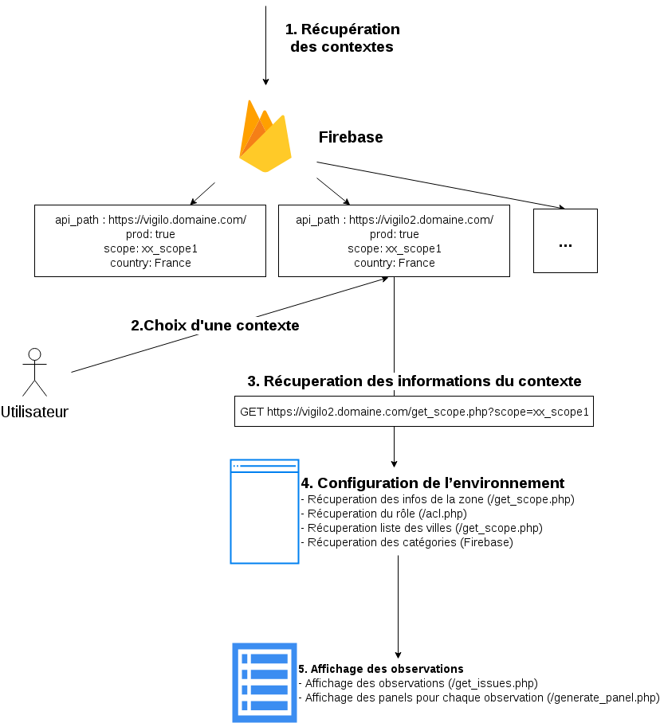

### Présentation

Ce repository consiste à centraliser les informations liées à l'écosystème Vigilo.

## Liste des repos Vigilo

* [vigilo-documentation](https://github.com/jesuisundesdeux/vigilo-documentation) : Ce repository centralise les informations liées à l'écosystème Vigilo.
* [vigilo-charte-graphique](https://github.com/jesuisundesdeux/vigilo-charte-graphique) : Met à disposition les ressources graphiques necessaire pour le fonctionement de l'application
* [vigilo-backend](https://github.com/jesuisundesdeux/vigilo-backend) : Code de l'API à utiliser pour l'installation de chaque instance
* [vigilotools](https://github.com/jesuisundesdeux/vigilotools) : Code du client python d'analyse de données Vigilo
* [vigilo-mobile-flutter](https://github.com/jesuisundesdeux/vigilo-mobile-flutter) : Projet en cours d'application cliente cross-plateform pour Vigilo
* [vigilo-webapp](https://github.com/jesuisundesdeux/vigilo-webapp) : Code du client web (app.vigilo.city)
* [docker-vigilo-backend](https://github.com/jesuisundesdeux/docker-vigilo-backend) : Image docker utilisée pour Vigilo
* [vigilo-notebooks](https://github.com/jesuisundesdeux/vigilo-notebooks) : Notebooks d'analyse de données Vigilo
* [docker-vigilo-notebooks](https://github.com/jesuisundesdeux/docker-vigilo-notebooks) : Image docker utilisé pour les notebooks.

## Fonctionnement Vigilo

Vigilo est un ecosystème réparti sur plusieurs composants :

### Firebase

C'est le composant le plus résilient, qui centralise la configuration globale à l'écosystème. Il stocke la liste des contextes Vigilo et les catégories utilisées par toutes les instances.

*Contexte = Instance (backend) + Scope*

Les instances sont paramétrées comme suit :
* api_path : URL complete du backend
* prod : (true|false) si 

### Backend 

C'est l'API sur laquelle se connecteront les différents clients (mobiles, web, python, analyses, maps ...)  
Le backend peut être instancié pour chaque orgnanisme territorial/association et est connu des clients grâce à firebase.

